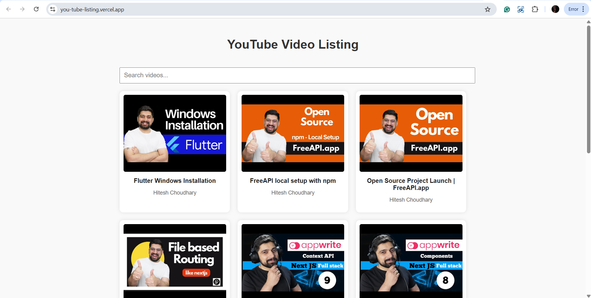

# YouTube Video Listing

A simple web application that fetches and displays a list of YouTube videos using the FreeAPI YouTube endpoint.

## Features

- **Video Listing**: Displays video thumbnails, titles, and channel names.
- **Video Playback**: Click on a video to open it directly on YouTube.
- **Search Functionality**: Filter videos by title or channel name without additional API calls.
- **Responsive Grid Layout**: Ensures a user-friendly interface across devices.

## Live Site

Link : https://you-tube-listing.vercel.app/

## ScreenShot



## How to Use

1. **Clone the Repository**:
   ```bash
   git clone https://github.com/rakshithsantosh/youTubeListing.git
   ```
